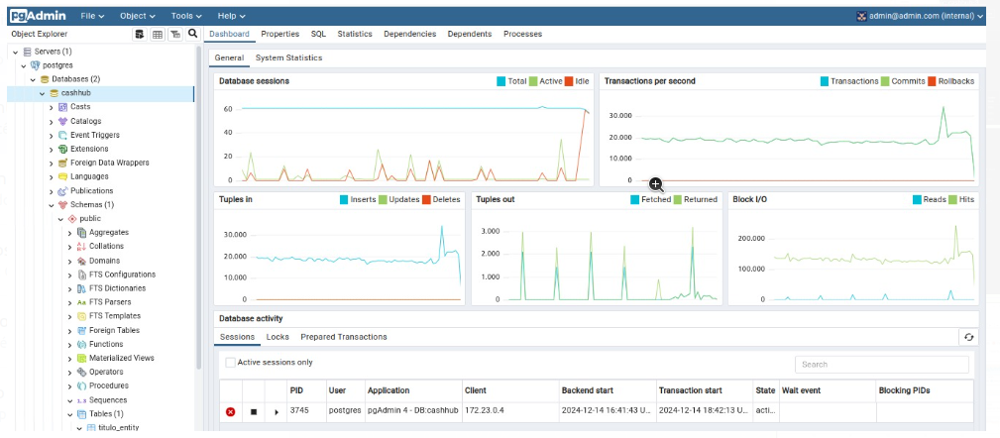

# Kafka Consumers and Automation Project

Este projeto organiza e gerencia múltiplos **consumidores Kafka** para integração com diferentes serviços e canais. A estrutura foi projetada para facilitar a escalabilidade e modularidade dos consumidores.

## Estrutura do Projeto

- **consumer/**: Diretório principal contendo módulos de consumidores para:
  - E-mail (`consumer-email`)
  - Telegram (`consumer-telegram`)
  - Webhook (`consumer-webhook`)
  - WhatsApp (`consumer-whatsapp`)
- **dashboard/**: Ferramenta ou interface para monitoramento e acompanhamento.
- **produtor/**: Módulo responsável pela produção de mensagens Kafka.

## Scripts Auxiliares

- **build.sh**: Script para construir o projeto.
- **run.sh**: Script para iniciar os serviços.
- **kill-process.sh**: Script para interromper processos em execução.
- **docker-compose.yml**: Configuração para orquestração com Docker.

## Requisitos

- Docker e Docker Compose instalados.
- Kafka configurado e em execução.

## Execução

1. **Build do projeto**:  
   ```bash
   ./build.sh


Performance do banco Postgres:



Monitoramento:

